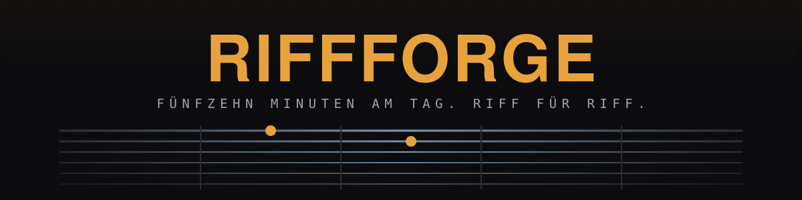
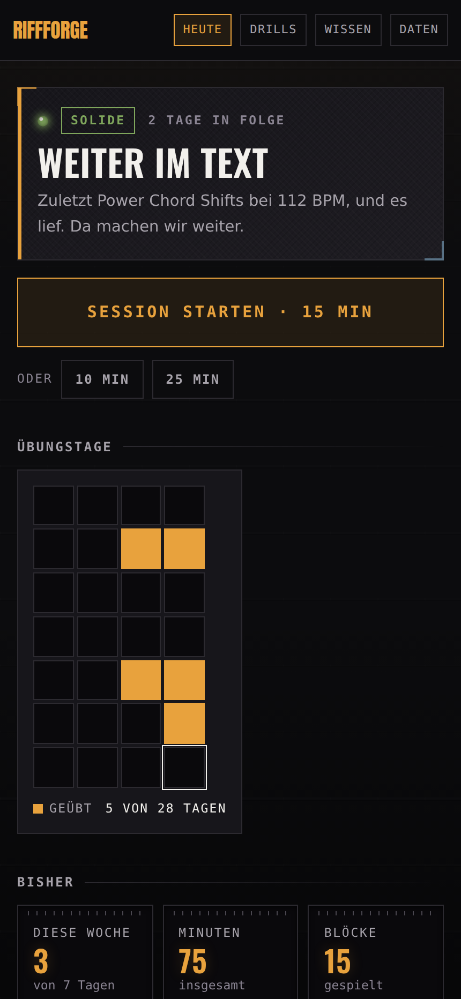
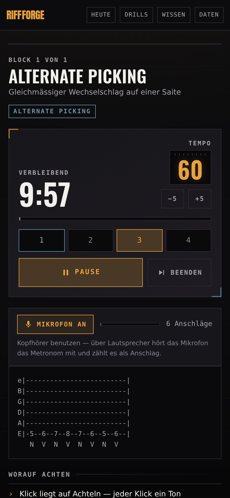
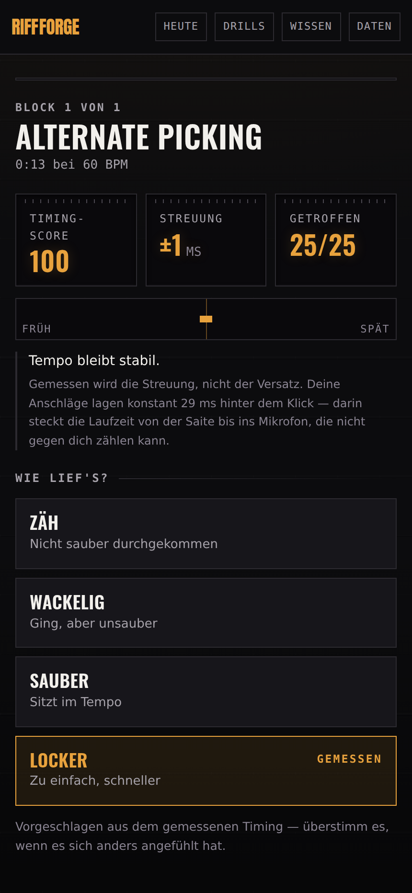
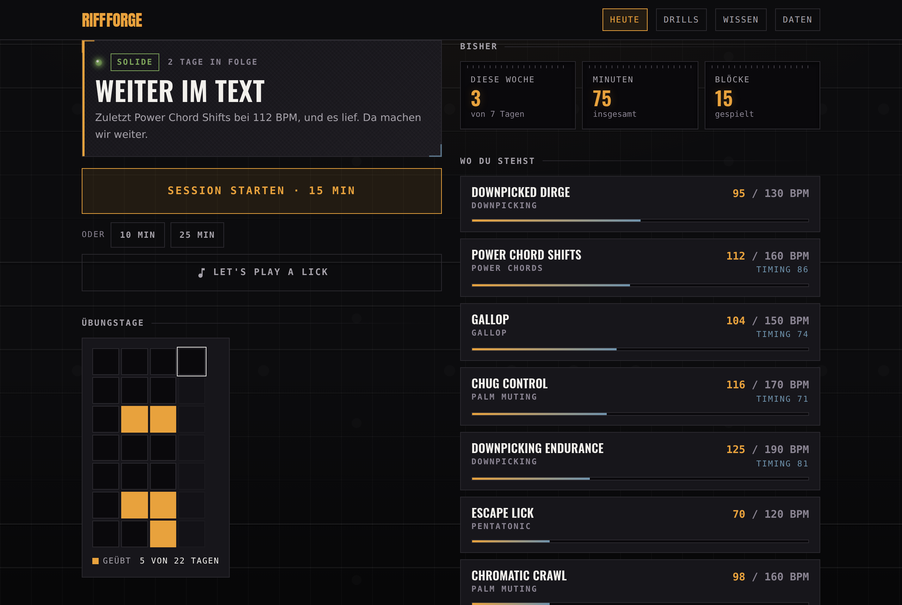
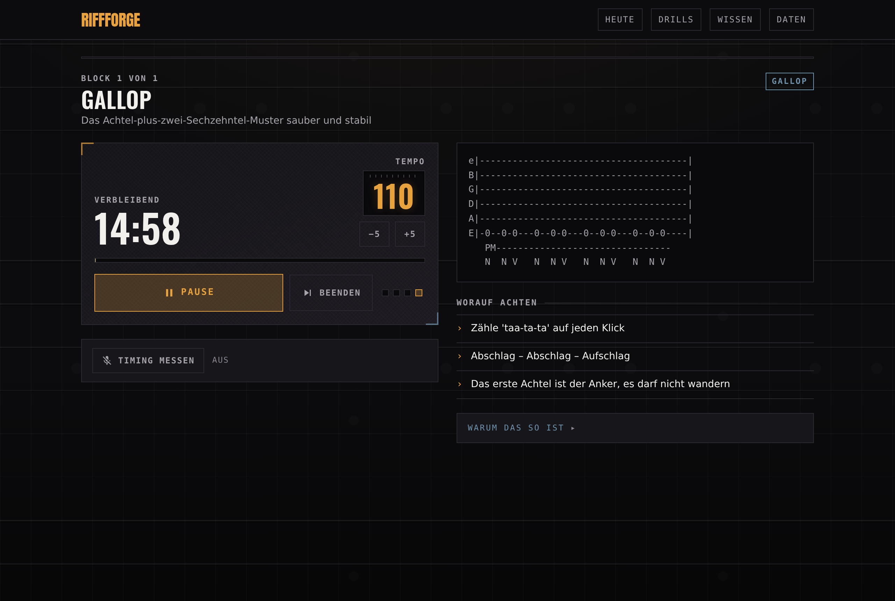
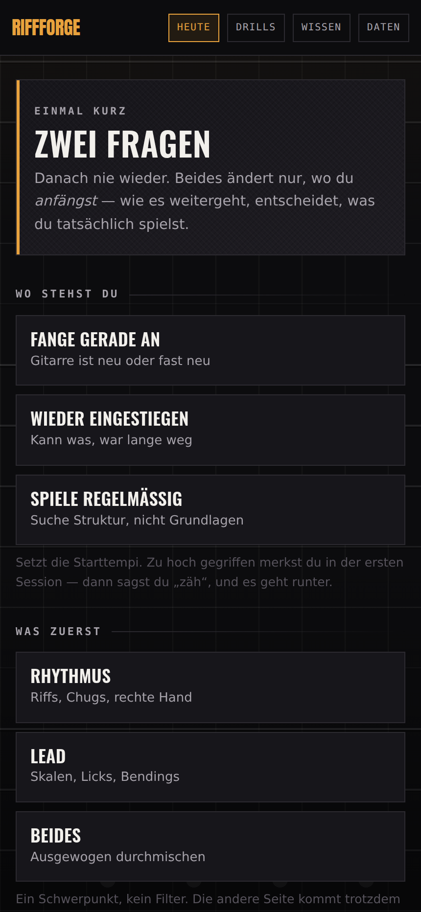
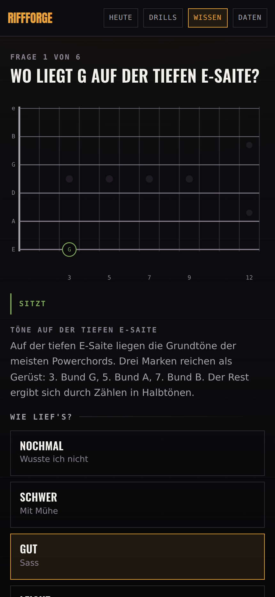

<p align="center">
  
</p>

<p align="center">
  <a href="https://cyphomat.github.io/riffforge/"></a>
  
  
  
</p>

<p align="center">
  <b>A practice app for one person.</b><br>
  Not a course catalogue, a workbench. Start, play for fifteen minutes, done — again tomorrow.
</p>

<p align="center">
  <sub>100% vibe coded. Use at your own risk. Feature requests welcome.</sub>
</p>

<p align="center">
  <a href="README.md">Deutsch</a> · <b>English</b>
</p>

> **A note on language.** The app's interface is **German only**. The exercises,
> the cues and the daily briefing are instructional text that has to be
> translated by meaning rather than word for word, so it has deliberately not
> been touched yet. This file explains what the app does; the app itself will
> talk to you in German.

---

## What it looks like

<table>
<tr>
<td width="33%"></td>
<td width="33%"></td>
<td width="33%"></td>
</tr>
<tr>
<td align="center"><b>The briefing</b><br><sub>What today is about, and why</sub></td>
<td align="center"><b>In a block</b><br><sub>Clock, tempo, tab, metronome</sub></td>
<td align="center"><b>Afterwards</b><br><sub>What the microphone heard</sub></td>
</tr>
</table>

**On a Mac it becomes an overview** — briefing, practice calendar, numbers and
tempos side by side instead of stacked:



**And inside a block the clock sits next to the tab**, so nothing has to be
scrolled while you play:



<sub>Real screens with sample data, captured via <code>tools/shots.mjs</code>. No mockups — the timing figures above come from an actual measurement.</sub>

---

## The first launch

<p align="center">
  
</p>

Two questions, then never again: **where you are** and **what interests you
first**. Both change something real — the first sets the starting tempo of every
drill, the second weights what comes up first.

A focus is a nudge, not a filter: pick lead and you will still get to the
picking hand, just later. And both only affect where you *start* — once there is
a log, the tempo carries itself forward and the answer stops mattering.

## How a session runs

Always the same shape, so it costs no decision:

```
Warm-up     2 min    wake the hands up
Technique  ~3 min    one thing in isolation, with a metronome
Riff       ~3 min    the same technique in a musical context
Technique  ~3 min    second round, with something else in between
Riff       ~3 min    second round
Wrap-up              how did it go — goes into the log
```

Two batches of two knowledge questions sit in the transitions, roughly forty
seconds each. At the end: **call it a day** or **+5 minutes**. The shape is
fixed, the content adapts, and the questions are
[skippable](#inside-a-session) — they never make the session longer.

## What it tells you

The difference from a metronome with tab pictures: it has an opinion about
today — from the log, not from a hunch.

- **The briefing** reads the last session, the running streak and the break
  before it, and picks between `START`, `BREAK`, `TECHNIQUE`, `SOLID` and
  `HARD`. Every line is verifiable in the log:

  > **TECHNIQUE** — Clean today, not fast.
  > *Gallop was shaky at 95 BPM last time. The tempo stays until it sits.*

- **One shaky block outweighs three clean ones.** What does not sit sets the
  tone — not the average.
- **The tempo carries itself forward.** Got through cleanly means faster next
  time, struggled means slower. Shaky means the same tempo again, because that
  is exactly where consolidation happens.
- **What comes up** is chosen by two forces: what sits worst, and what has gone
  longest untouched.
- **A drill you know comes up twice** — with something else in between. That is
  the [contextual interference effect](https://www.ncbi.nlm.nih.gov/pmc/articles/PMC4989027/):
  distributed repetition is retained measurably better than one long block, even
  though it feels worse. A **new** drill gets its block in one piece — when you
  are still acquiring a movement, that is the better order.
- **The achievement first, the report second.** New personal bests sit at the
  top after a session.
- **The practice calendar** shows sixteen weeks at once. Deliberately just
  practised or not, with no shading by minutes: a session is around a quarter of
  an hour by construction, so showing the minutes as a colour ramp would be
  dressing up noise as signal. What matters here are streaks and gaps.

## The drills

Twenty of them. The tempo on the right is start → target; where you actually
begin depends on your answer at first launch, and where it goes depends on what
you play.

**Warm-up**

| Drill | Technique | Goal | BPM |
|---|---|---|---|
| Chromatic 1-2-3-4 | — | Finger independence, and waking the hand up | 60 → 120 |
| String Skipping | — | Picking hand hits its target without looking | 60 → 130 |

**Technique**

| Drill | Technique | Goal | BPM |
|---|---|---|---|
| Downpicking Endurance | Downpicking | Stamina in pure downstrokes — the core of the thrash sound | 90 → 190 |
| Chug Control | Palm muting | Even palm mutes — every chug the same volume, the same length | 80 → 170 |
| Gallop | Gallop | The eighth-plus-two-sixteenths figure, clean and steady | 70 → 150 |
| Power Chord Shifts | Power chords | Position changes with no gap and no string noise | 70 → 160 |
| Alternate Picking | Alternate picking | Even alternate picking on one string | 60 → 140 |
| Pentatonik Box 1 | Pentatonic | A minor pentatonic in 5th position, up and down | 60 → 150 |
| Bending & Vibrato | Bending | Hit the pitch of a whole-step bend and hold it | 50 → 100 |
| Hammer-on und Pull-off | Legato | Notes made by the fretting hand alone | 55 → 130 |
| Slides | Slides | Position changes in tempo, without losing the note | 55 → 120 |
| Dead Notes | Dead notes | Attacks without pitch — filling the gaps without muddying the sound | 60 → 140 |
| Tremolo Picking | Tremolo | Very fast alternate picking on one string, evenly | 70 → 180 |

**Riff**

| Drill | Technique | Goal | BPM |
|---|---|---|---|
| Ironclad | Gallop | Gallop plus a position change — the first real riff | 70 → 145 |
| Chromatic Crawl | Palm muting | Open chugs against chromatic target notes — timing under pressure | 80 → 160 |
| Downpicked Dirge | Downpicking | Slow, heavy, all downstrokes — timing with nowhere to hide | 60 → 130 |
| Escape Lick | Pentatonic | First lead lick: pentatonic with a bend at the end | 55 → 120 |
| Ghost Machine | Dead notes | Dead notes in a riff — sixteenths where only half of them ring | 60 → 150 |
| Hammer Down | Legato | Legato out of the open string, in a riff | 55 → 130 |
| Lick Forge | Pentatonic | A fresh lead lick from the pentatonic box — stays until you own it | 50 → 130 |

## One lick

Next to the quarter hour there is a second entrance: **one lick** — the ghost
button under the start button, or `/lick` directly. Three minutes of lead
playing, with no session around it, for when you just feel like it.

The lick is **computed**, not pulled from a list. Rolling dice over the
pentatonic scale would produce note salad, and what you would mostly fail to
learn from it is *phrasing*. So every lick has the same shape — two bars of
4/4 on eighths:

```
Motif        three or four notes with a direction: up, down, arc, zigzag
Development  the same motif repeated, sequenced or inverted
Approach     stepwise towards the target note
Resolution   root or fifth, on beat three, held with vibrato
```

The target note is a stable one, because a lick that stops on the minor third
sounds cut off rather than open.

You can pick **all twelve roots in five positions** — sixty boxes. The picker
names the lowest fret rather than just the position number: "position 3" tells
you nothing under your fingers, "from fret 8" does. The positions run in a
circle, and which one sits lowest depends on the root: in A minor it is
position 4, not position 1.

A lick **stays until you rate it clean** — then the next one comes. It writes
into the same log and under the same drill id as the Lick Forge inside a
session: the generator is the drill, the lick is the content. A tempo curve
across a string of different licks would mean nothing, and neither would two
halves that know nothing about each other.

The microphone only hears the **rhythm** here. Whether the *notes* were right
is something the app cannot know, and it does not claim to —
[pitch detection](#what-is-still-coming) is what would change that.

## Knowledge

<p align="center">
  
</p>

Fifteen minutes of playing and some theory go badly together if the theory is a
second screen to read. So here the **question is the normal state** and the text
is what comes after it: retrieval is measurably better for retention than
re-reading, and in music it is barely used.

Eighty-seven concepts across six levels — from the semitone to how riffs are put
together. Each with two or three sentences and a question:

- **Answer on the fretboard** where that is possible. Producing an answer beats
  picking one of four boxes, and the guitar is the instrument where theory can
  be shown rather than written down. The same note sits in several places: hit
  any of them and you are right.
- **After every answer the right one is shown**, with the sentence that explains
  why. Without feedback, the benefit of retrieval practice actually reverses at
  low success rates.
- **When something comes back** is decided by [FSRS-6](https://github.com/open-spaced-repetition/free-spaced-repetition-scheduler) —
  three numbers per card rather than a rule of thumb. Ported from the reference
  implementation and checked against 76 of its results, not reinvented.
- **Card state is replayed, not stored.** Answers are immutable; two devices
  merge their answers and arrive at the same state on their own.

Notes are named the way tabs name them: the note above A is **B**. A German
sheet-music habit of typing **H** for it gets that explained rather than a bare
"wrong" — the right note was meant, just written in the other language.

### Inside a session

The questions do not wait on the knowledge screen; they arrive mid-practice, in
the transitions where the pick gets put down anyway — four of them, around
eighty seconds. The session does not grow because of
them, and nothing is blocked by them: **Überspringen, weiterspielen** is always
there, and the cards stay due. If nothing is due, the batch is skipped silently.

The first batch **primes**: it asks about the technique that comes up in the
next block. That is the link to what is being played — theory without it stays a
hobby of its own.

### A question you play

Seven cards do not ask for a term but for a figure: **play two bars of gallop.**
The microphone listens, and the verdict is measured rather than guessed — no
flashcard program can do that, and it falls out here because the onset detection
is already there.

Two bars of count-in first, one note per beat. That is where the signal chain's
delay is measured; only then does the figure count. Without that anchor it would
not work: a figure is uneven, and a delay in the order of its own spacing looks
like a *different* figure — measured, a reverse gallop shifted by 125 ms fits a
gallop to over eighty percent. On evenly spaced beats the delay is unambiguous.

Two things are counted: whether the attacks that were asked for arrived — and
whether *only* those did. Without the second number, mindlessly playing through
would pass every figure question, because a gallop's expected moments all sit on
the sixteenth-note grid. For the same reason there is no question asking for
sixteenths: they are the finest grid, every other figure is a subset of them,
and the question could be passed with almost anything.

A figure may also be longer than one beat. Three-note groupings — dotted
eighths — only land back on the beat after three of them; that question runs
three bars instead of two.

For one card, loudness counts as well: **dead notes** are indistinguishable from
straight sixteenths in time alone, the difference is entirely in how quiet the
muted attacks are. Measured, they still separate from the noise by a factor of
1.5 under heavy distortion. Accents do not — they stay between 1.15 and 1.24 and
sit inside that noise. So they are explained rather than measured.

Without a microphone nothing is blocked: the explanation can be shown anyway.
That counts as *not measured*, not as played wrong — at that point the app
simply knows too little to judge.

## What the microphone hears

Switchable on in any block. It listens for **attacks, not pitches** — with a
distorted guitar, pitch tracking is unreliable while transients are unambiguous,
and for rhythm work the moment a note starts is the whole question anyway.

Two numbers that must not be confused:

| | |
|---|---|
| **Spread** | How even you are. **That** is the playing quality, and the score is built on it. |
| **Offset** | The constant distance from the click. Full of travel time — string → air → microphone → buffer. Does **not** count against you. |

The offset is estimated **before** matching. Without that step, Bluetooth
headphones (150–300 ms of latency) make every note miss its click, and the
measurement silently reads as "heard nothing".

A **negative** offset, by the way, is not a latency artefact: travel time can
only make a note later, never earlier. If you are ahead, you really are ahead —
and the app says so.

Afterwards it proposes the self-assessment itself. You can overrule it.

> **Use headphones.** Through speakers the microphone hears the metronome too
> and counts it as an attack.

Nothing is recorded and nothing is uploaded — only the moment of each attack is
evaluated.

---

## Installing it as an app

**iPhone / iPad** — open it in **Safari** (Chrome on iOS cannot do this),
Share → *Add to Home Screen*.

**Mac** — Safari 17+: *File → Add to Dock*. In Chrome: the icon in the address
bar → *Install*.

It then starts without browser chrome, has its own icon and **works offline** —
after the first visit everything is cached and a session needs no network.

Installing pays off for a less obvious reason too: Safari clears the storage of
ordinary websites after seven days without a visit. Home-screen apps are exempt
— so your practice log only survives if you actually install it.

### Two iOS quirks

- **The ringer switch has to be on.** iOS mutes Web Audio when the device is
  silenced — the metronome then stays quiet, with no error message. That is an
  iOS behaviour, not a fault of the app.
- **The microphone needs iOS 14.3 or newer.** Before that, Safari gave no
  microphone access in home-screen mode.

## Data

Your practice log lives in `localStorage` on the device. No account, no server —
as long as you set nothing else up, nothing leaves the browser.

Under **Daten** you can pull it out as JSON and put it back in — the practice
log and the answered knowledge questions in one file. An import **adds rather
than replaces**: entries are immutable and carry a drill and a timestamp, so the
union of both sides is the right answer — two devices that practised
independently are both right. Before applying, the app shows how much of it is
actually new.

### Syncing between devices

The same screen can connect a **private data repository**. The app then also
writes the log there as a single file, and iPhone and Mac pull each other up to
date — automatically after every session, or by hand.

Neither side wins. On a write conflict it re-reads, merges again and writes once
more; the same union as on import. A sync with no news produces no commit.

Two files live there: `uebungen.json` and `theorie.json`. Separate for a
concrete reason — a device on an older build does not know a newer field, strips
it on read, and would write it away on the next sync. Two files cannot delete
each other.

What you need: a private repository (say `riffforge-data`) and a
**fine-grained** token that points at it alone, with *Contents: Read and write*.
Narrow for a concrete reason — every page under `github.io` shares one browser
storage, so a token that can open only one data repository limits the damage if
any of those pages ever has a hole.

If the data repository is public, the app says so clearly: it works exactly the
same, only everyone can read along.

### Version and updates

Under *Daten* you can see which build is running — commit and date — and whether
the server has a newer one. On a phone that is not a luxury: an installed PWA
keeps its shell in storage, and without this comparison nobody notices they have
been starting a weeks-old build. **Jetzt aktualisieren** clears the offline
storage and reloads; the practice log, the profile and the sync settings are
untouched.

The comparison needs no outside network: the build stamp sits next to the app as
`version.json`, and the same stamp is baked into the bundle. If they disagree,
the browser is holding an old build.

**If this is a fork**, the app says so — and offers to check how far the original
has moved on since. That single request goes to `api.github.com` and only on a
button press; the original's own deployment never makes it.

### Deleting means deleting

**Alles löschen** under *Daten* clears the log, any set-aside copy of it and the
two answers from the first launch. The app is then back to freshly installed.
**Trennen** removes the account, repository and token from browser storage.

### What the app does not do

No analytics, no fonts from someone else's server, no embeds — measured, not
claimed: loading every page and playing a full session sends **not one request**
to any other host. `api.github.com` is the only foreign address at all, and even
that only twice: for syncing, if you set it up, and on a button press to check
the original — the latter only in a fork.

The microphone does not leave the machine: the audio thread reports **timestamps
and a level value**, nothing else. No audio is recorded, stored or sent, and the
capture is released again after every block.

Since GitHub Pages serves no headers of its own, the Content Security Policy
sits in the page as a meta tag. The part that matters is `connect-src`: requests
may only go to the site itself and to GitHub. If foreign script ever got into
the page, it would have nowhere to send the token or the log.

---

## Development

```bash
pnpm install
pnpm dev          # http://localhost:3000
```

```bash
pnpm test         # Vitest — the logic in lib/session and lib/audio
pnpm check        # types, tests and lint in one go
pnpm build        # static export to out/
```

The logic in `lib/session/`, `lib/audio/timing.ts` and `lib/sync/store.ts` is
pure: no React, no browser APIs. That is why it is testable, and that is why the
tests live there. New rules about tempo, selection or scoring belong there, not
in a component.

The microphone needs a secure context. `localhost` counts as secure, an IP on
your home network does **not** — so test on a phone through the published site,
not through `http://192.168.…`.

New screenshots for this page:

```bash
pnpm build && (cd out && python3 -m http.server 3100 &)
node tools/shots.mjs
```

Architecture and conventions are in [CLAUDE.md](./CLAUDE.md) — in German, like
the code comments.

## Deployment

Push to `main` → GitHub Actions builds the static export and publishes it to
GitHub Pages ([`.github/workflows/pages.yml`](.github/workflows/pages.yml)). The
workflow lets nothing through that breaks `pnpm check`.

Pages serves from `/<repo>/`, which is why the workflow sets
`NEXT_PUBLIC_BASE_PATH`. Paths built at runtime — the audio worklet, the service
worker — have to go through `asset()` from `lib/base-path.ts`, or they reach
past the subdirectory.

## Content

All drills and riffs are **original** exercises in the idiom. No transcribed
tabs, no audio from copyrighted recordings.

## What is still coming

- **A tuner.** Autocorrelation is enough for it, and you need one before every
  session anyway.
- **Calibration**: measure the offset once and keep it, instead of estimating it
  per block. `AudioContext.outputLatency` would do it — only Safari does not
  expose it, neither on the Mac nor on the iPhone.
- **The iOS ringer switch.** There is a known trick for making Web Audio sound
  despite the mute switch. Untested, so not in yet.

## Thanks

The design language, the tone and the idea of the briefing come from
[Setlist](https://github.com/cyphomat/setlist) — the sister project, for
training. No neon: a tube amp glows, it does not beam.
